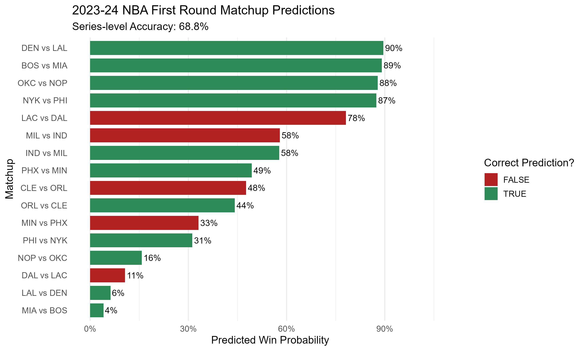

# 🏀 NBA Postseason Win Probability Model

A modular, end-to-end machine learning pipeline in **R** designed to predict the **series win probability between two NBA teams in a playoff matchup**. This project processes historical regular season and playoff game-level data to generate matchup-specific features, train a predictive model, and visualize the results — with no data leakage and high modularity.

<p align="center">
  
</p>

---

## 🧠 Project Purpose

The goal of this project is to **predict the probability that a given NBA team will win a playoff series** using a blend of historical regular season performance, head-to-head metrics, and playoff-specific context. The model is trained on data from **2004–2022** and evaluated on **first-round playoff matchups from 2023**, successfully predicting 6 out of 8 matchups correctly.

---

## 🔧 Technologies Used

This project is written entirely in **R**, using the following libraries:

- 📦 `dplyr`, `purrr`, `tibble`, `tidyr` — data manipulation and transformation
- 📉 `readr` — efficient CSV handling
- 📊 `ggplot2`, `scales` — visualizations
- 🗂️ `here` — consistent project-relative pathing
- 🧱 `slider` — for custom rolling window metrics
- 🪵 `logging` — custom log output for pipeline execution

---

## 🗂 Project Structure

<pre>
/nba-postseason-pipeline
├── Code/ # All scripts organized by pipeline stage
│ ├── data_processing/ # Metric creation, data merging, labeling
│ ├── model_training/ # Model training logic
│ ├── model_prediction/ # Model prediction logic
│ ├── visuals/ # Visualization functions
│ ├── utilities/ # Logging and pipeline orchestration
│ ├── config/ # Project constants and path references
│ └── main.R # Single entry point to run the full pipeline
│
├── Data/
│ ├── team_data.csv # Raw regular season & playoff stats
│ ├── actual_results_2023.csv # 2023 playoff series outcomes
│ └── Built Datasets/ # Intermediate files
│
├── Results/
│ ├── predictions.csv # Final model predictions
│ └── model.Rds # Serialized trained model
│
├── Visualizations/
│ ├── 2023_playoff_predictions.png
│ └── 2023_confidence_accuracy.png
│
├── Logs/
│ └── pipeline.log
└── README.md
</pre>

---

## 🧪 How the Model Works

The model pipeline proceeds through the following stages:

1. **Data Ingestion & Cleaning**  
   Ingests raw team-level data from both regular season and playoff games (2004–2023), transforming each row from an offensive team POV to usable metrics.

2. **Feature Engineering**  
   Generates advanced metrics:
   - Regular season averages
   - Rolling playoff performance
   - Head-to-head matchup features
   - Playoff-specific historical trends

3. **Series Labeling & Dataset Creation**  
   Combines all metrics into a training dataset where each row represents a single playoff series with a binary outcome.

4. **Model Training**  
   Trains a logistic regression model (or other ML approach) on pre-2023 data, using feature selection and standardization.

5. **Prediction on 2023 Matchups**  
   Uses 2023 regular season + historical features to predict first-round playoff matchups — **with no data leakage**.

6. **Evaluation & Visualization**  
   Compares predicted results to actual outcomes and generates clean visuals like:

   - ✅ Win Probability by Matchup  
   - 🎯 Confidence vs Accuracy

---

## 📸 Example Results (2023 Predictions)

**Model Accuracy:** 6/8 correct matchups  
**Sample Output:**

| Team | Opponent | Predicted Win Prob |
|------|----------|--------------------|
| DEN  | LAL      | 89.5%              |
| BOS  | MIA      | 89.1%              |
| OKC  | NOP      | 87.8%              |
| ...  | ...      | ...                |

Visuals can be found in the [`/Visualizations`](Visualizations/) folder.

---

## 🚀 How to Run the Pipeline

> **Prerequisite:** Ensure all R packages listed above are installed.

1. Clone the repo:
   ```bash
   git clone https://github.com/yourusername/nba-postseason-pipeline.git
   ```
2. Open R or RStudio and set working directory to the project root.

3. Run the full pipeline:
   ```bash
   source("Code/main.R")
   ```
4. View results:
      - Check Results/predictions.csv for model outputs
      - Check Visualizations/ for performance plots

---

## 🧭 Future Improvements
- Migrate to Python with nba_api for live and up-to-date data access
- Build a Streamlit app for interactive matchup predictions
- Integrate player-level or lineup-based advanced metrics
- Explore ensemble methods for prediction confidence calibration

